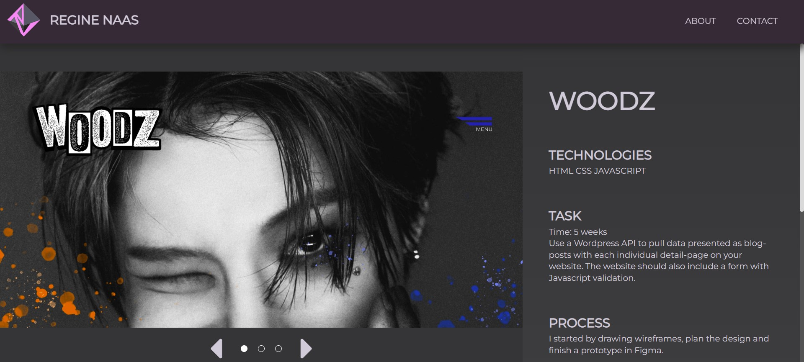

# Portfolio 1

  
[Visit deployed site here](https://portfolio-1-moami.netlify.app/ "Momifolio")

---

# Process and results

I created a simple one-page website that gives a short summary of each big project we did during the past year.

The page is not quite finished as there is no functioning links to "contact" or "about". The main goal of this website was just to present my projects, not to create a fully finished portfolio.

Later we will create new complete portfolios.

---

# Assignment

To create a portfolio page that showcases some of the projects we have worked on during the first two semester of Front-End Development at Noroff.

Your goal should be to present each projects and give a brief summary of what the task was, technologies used, what went well and which parts could be improved.

---

# Sources

custom radiobuttons
https://moderncss.dev/pure-css-custom-styled-radio-buttons/
